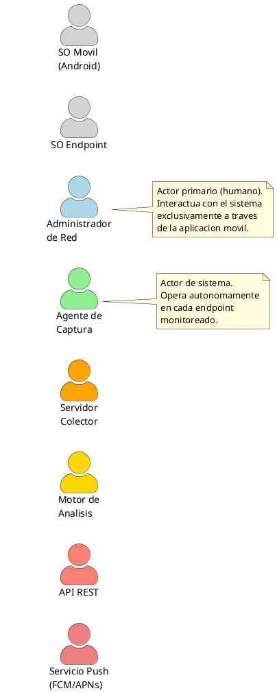
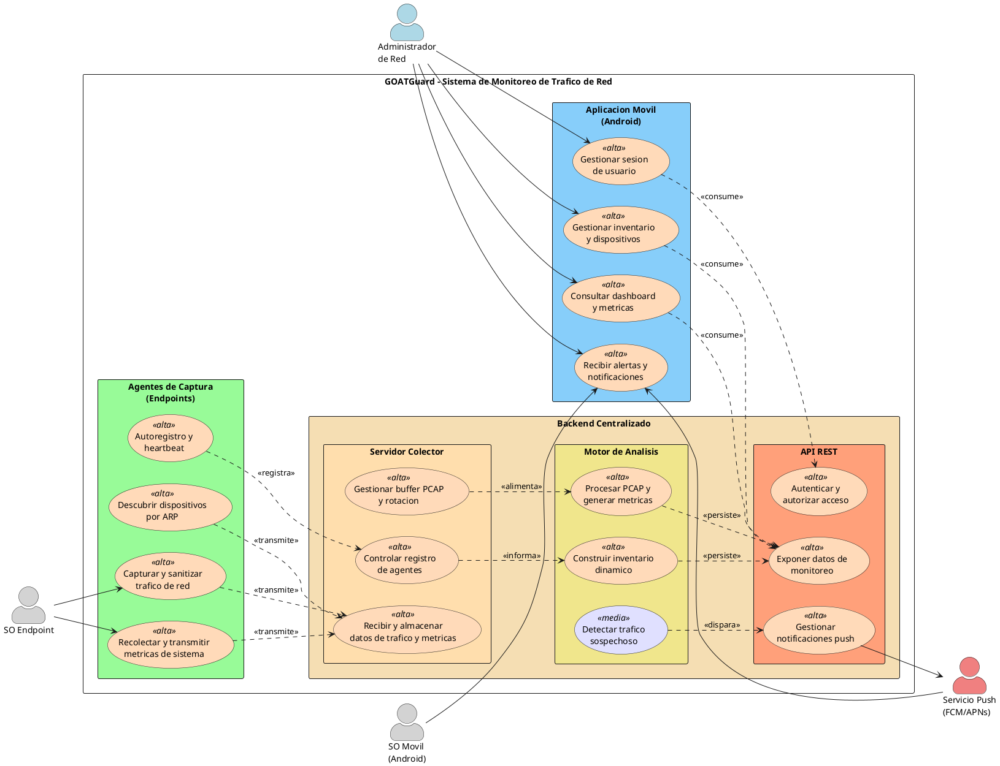
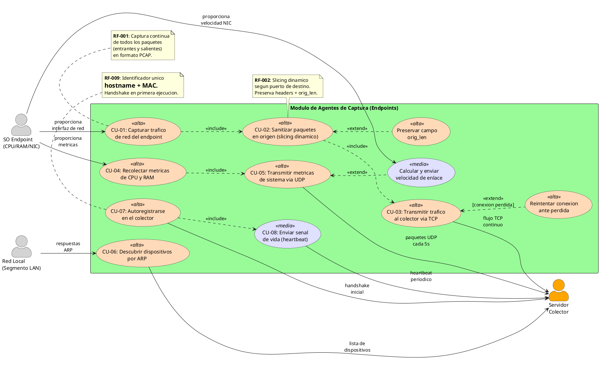
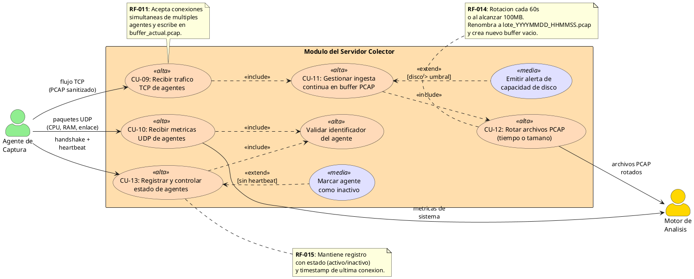
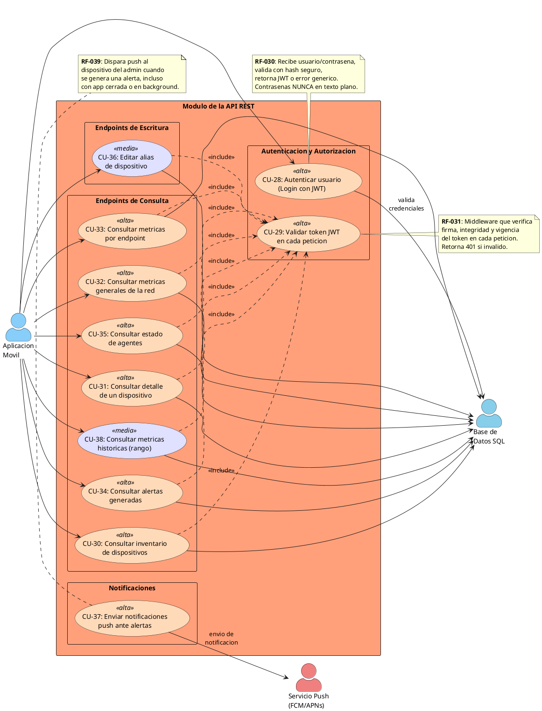
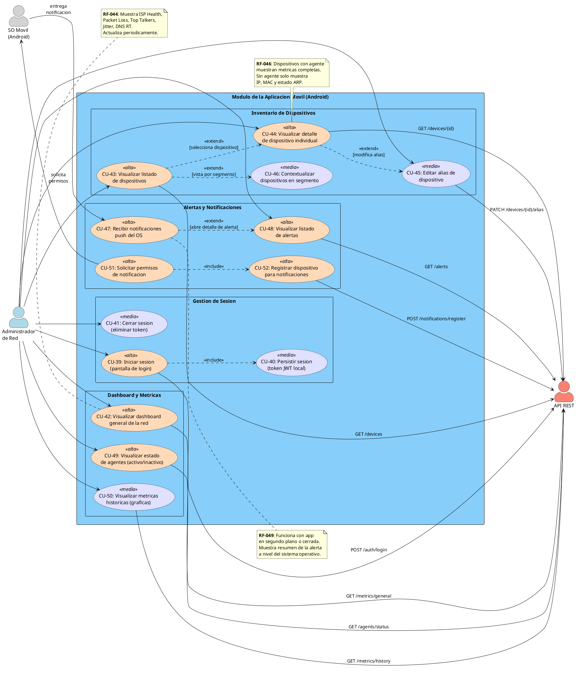
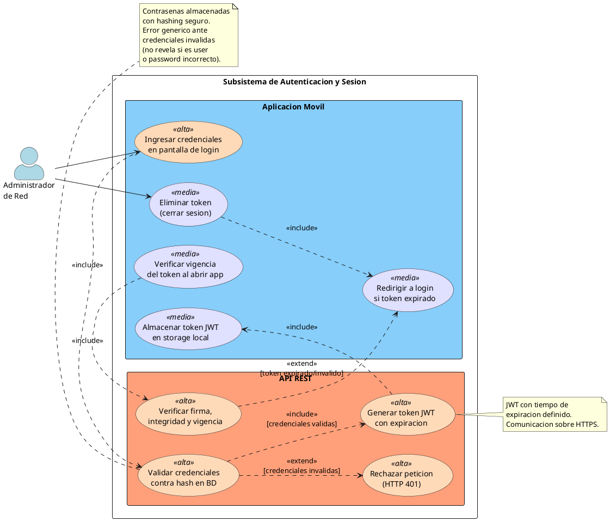
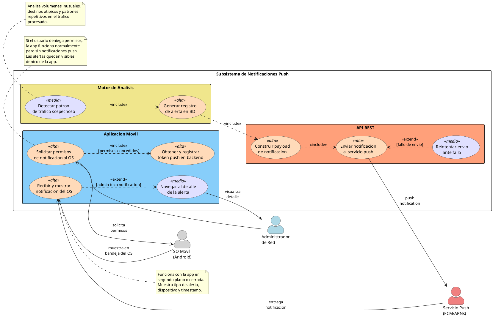

# Diagramas de Casos de Uso - GOATGuard

## Proyecto: Sistema de Monitoreo de Trafico de Red Local
## Fecha: 2026-03-03
## Autor: Arquitectura de Software - GOATGuard

---

## Tabla de Contenidos

1. [Identificacion de Actores](#1-identificacion-de-actores)
2. [Identificacion de Casos de Uso Principales](#2-identificacion-de-casos-de-uso-principales)
3. [Diagrama General del Sistema](#3-diagrama-general-del-sistema)
4. [Modulo de Agentes de Captura](#4-modulo-de-agentes-de-captura)
5. [Modulo del Servidor Colector](#5-modulo-del-servidor-colector)
6. [Modulo del Motor de Analisis](#6-modulo-del-motor-de-analisis)
7. [Modulo de la API REST](#7-modulo-de-la-api-rest)
8. [Modulo de la Aplicacion Movil](#8-modulo-de-la-aplicacion-movil)
9. [Subsistema de Autenticacion y Sesion](#9-subsistema-de-autenticacion-y-sesion)
10. [Subsistema de Notificaciones Push](#10-subsistema-de-notificaciones-push)
11. [Matriz de Trazabilidad Actores vs Casos de Uso](#11-matriz-de-trazabilidad-actores-vs-casos-de-uso)

---

## 1. Identificacion de Actores

| Actor | Tipo | Descripcion |
|-------|------|-------------|
| **Administrador de Red** | Primario (Humano) | Usuario principal del sistema. Accede a la aplicacion movil mediante credenciales autenticadas. Posee conocimientos tecnicos en administracion de redes. Consulta metricas, inventario, alertas y gestiona alias de dispositivos. |
| **Agente de Captura** | Sistema (Software) | Componente de software desplegado en cada endpoint. Opera de forma autonoma capturando trafico, recolectando metricas del sistema operativo, descubriendo dispositivos por ARP y transmitiendo datos al colector. |
| **Servidor Colector** | Sistema (Software) | Componente backend que recibe y almacena los flujos de trafico TCP y metricas UDP provenientes de los agentes. Gestiona el registro de agentes, rotacion de buffers PCAP y control de estado de conexiones. |
| **Motor de Analisis** | Sistema (Software) | Componente backend que procesa los archivos PCAP rotados, genera metricas contextualizadas (ancho de banda, Top Talkers, latencia, jitter, retransmisiones TCP, DNS, packet loss), construye el inventario dinamico y detecta patrones de trafico sospechoso. |
| **API REST** | Sistema (Software) | Capa de exposicion que autentica usuarios via JWT, expone endpoints protegidos para consulta de inventario, metricas, alertas y estado de agentes, y gestiona el envio de notificaciones push. |
| **Servicio de Notificaciones Push (FCM/APNs)** | Externo | Servicio de terceros (Firebase Cloud Messaging o APNs) utilizado para entregar notificaciones push al dispositivo movil del administrador cuando se generan alertas de trafico sospechoso. |
| **Sistema Operativo del Endpoint** | Externo | Proveedor de metricas de CPU, RAM y velocidad de enlace de red. Tambien gestiona permisos de captura de paquetes a nivel de red en el endpoint donde opera el agente. |
| **Sistema Operativo Movil (Android)** | Externo | Gestiona los permisos de notificacion push en el dispositivo del administrador y entrega las notificaciones a nivel del OS incluso con la app en segundo plano o cerrada. |

### Diagrama de Actores y sus Relaciones

---

## 2. Identificacion de Casos de Uso Principales

Los casos de uso se organizan por modulo del sistema, alineados directamente con los requerimientos funcionales (RF-001 a RF-054).

### Modulo de Agentes de Captura
| ID CU | Nombre | RF Asociados | Prioridad |
|--------|--------|-------------|-----------|
| CU-01 | Capturar trafico de red | RF-001 | Alta |
| CU-02 | Sanitizar paquetes en origen | RF-002 | Alta |
| CU-03 | Transmitir trafico al colector (TCP) | RF-003 | Alta |
| CU-04 | Recolectar metricas de sistema (CPU/RAM) | RF-004, RF-005 | Alta |
| CU-05 | Transmitir metricas de sistema (UDP) | RF-006, RF-007 | Alta |
| CU-06 | Descubrir dispositivos por ARP | RF-008 | Alta |
| CU-07 | Autoregistrarse en el colector | RF-009 | Alta |
| CU-08 | Enviar senal de vida (heartbeat) | RF-010 | Media |

### Modulo del Servidor Colector
| ID CU | Nombre | RF Asociados | Prioridad |
|--------|--------|-------------|-----------|
| CU-09 | Recibir trafico TCP de agentes | RF-011 | Alta |
| CU-10 | Recibir metricas UDP de agentes | RF-012 | Alta |
| CU-11 | Gestionar ingesta en buffer PCAP | RF-013 | Alta |
| CU-12 | Rotar archivos PCAP | RF-014 | Alta |
| CU-13 | Registrar y controlar agentes | RF-015 | Alta |

### Modulo del Motor de Analisis
| ID CU | Nombre | RF Asociados | Prioridad |
|--------|--------|-------------|-----------|
| CU-14 | Procesar archivos PCAP rotados | RF-016 | Alta |
| CU-15 | Condensar y estructurar datos | RF-017 | Alta |
| CU-16 | Persistir metricas en base de datos | RF-018 | Alta |
| CU-17 | Limpiar archivos PCAP procesados | RF-019 | Media |
| CU-18 | Calcular ancho de banda por endpoint | RF-020 | Alta |
| CU-19 | Calcular Top Talkers | RF-021 | Alta |
| CU-20 | Calcular latencia ISP (ISP Health) | RF-022 | Alta |
| CU-21 | Calcular perdida de paquetes global | RF-023 | Alta |
| CU-22 | Calcular retransmisiones TCP | RF-024 | Alta |
| CU-23 | Calcular conexiones fallidas | RF-025 | Alta |
| CU-24 | Calcular DNS Response Time | RF-026 | Media |
| CU-25 | Calcular estabilidad de conexion (Jitter) | RF-027 | Media |
| CU-26 | Construir inventario dinamico de activos | RF-028 | Alta |
| CU-27 | Detectar patrones de trafico sospechoso | RF-029 | Media |

### Modulo de la API REST
| ID CU | Nombre | RF Asociados | Prioridad |
|--------|--------|-------------|-----------|
| CU-28 | Autenticar usuario (Login) | RF-030 | Alta |
| CU-29 | Validar token JWT | RF-031 | Alta |
| CU-30 | Consultar inventario de dispositivos | RF-032 | Alta |
| CU-31 | Consultar detalle de dispositivo | RF-033 | Alta |
| CU-32 | Consultar metricas generales de red | RF-034 | Alta |
| CU-33 | Consultar metricas por endpoint | RF-035 | Alta |
| CU-34 | Consultar alertas | RF-036 | Alta |
| CU-35 | Consultar estado de agentes | RF-037 | Alta |
| CU-36 | Editar alias de dispositivo | RF-038 | Media |
| CU-37 | Enviar notificaciones push | RF-039 | Alta |
| CU-38 | Consultar metricas historicas | RF-040 | Media |

### Modulo de la Aplicacion Movil
| ID CU | Nombre | RF Asociados | Prioridad |
|--------|--------|-------------|-----------|
| CU-39 | Iniciar sesion | RF-041 | Alta |
| CU-40 | Persistir sesion | RF-042 | Media |
| CU-41 | Cerrar sesion | RF-043 | Media |
| CU-42 | Visualizar dashboard general | RF-044 | Alta |
| CU-43 | Visualizar listado de dispositivos | RF-045 | Alta |
| CU-44 | Visualizar detalle de dispositivo | RF-046 | Alta |
| CU-45 | Editar alias de dispositivo | RF-047 | Media |
| CU-46 | Contextualizar dispositivos en segmento | RF-048 | Media |
| CU-47 | Recibir notificaciones push | RF-049 | Alta |
| CU-48 | Visualizar listado de alertas | RF-050 | Alta |
| CU-49 | Visualizar estado de agentes | RF-051 | Alta |
| CU-50 | Visualizar metricas historicas | RF-052 | Media |
| CU-51 | Solicitar permisos de notificacion | RF-053 | Alta |
| CU-52 | Registrar dispositivo para notificaciones | RF-054 | Alta |

---

## 3. Diagrama General del Sistema

Este diagrama presenta una vision de alto nivel de GOATGuard, mostrando los cuatro modulos principales y como los actores interactuan con cada uno. Permite entender el alcance completo del sistema y la separacion de responsabilidades entre componentes.

---

## 4. Modulo de Agentes de Captura

Este diagrama detalla los casos de uso del software agente que se instala en cada endpoint de la red. Muestra el ciclo completo desde la captura de paquetes, su sanitizacion, la recoleccion de metricas del sistema operativo, el descubrimiento de dispositivos vecinos por ARP, y los mecanismos de comunicacion con el colector (TCP para trafico, UDP para metricas). Las relaciones `<<include>>` representan dependencias obligatorias entre pasos del flujo.

### Descripcion de Flujos del Modulo de Agentes

- **CU-01 a CU-03 (Pipeline de Trafico):** El agente captura paquetes de la interfaz de red, los sanitiza aplicando slicing dinamico segun puerto de destino (preservando `orig_len` para calculo real de ancho de banda), y los transmite al colector mediante conexion TCP persistente. Si la conexion se pierde, reintenta automaticamente.

- **CU-04 a CU-05 (Pipeline de Metricas):** Recolecta periodicamente CPU y RAM del SO, empaqueta con timestamp e identificador, e incluye opcionalmente la velocidad de enlace. Transmite por canal UDP separado cada 5 segundos.

- **CU-06 (Descubrimiento ARP):** Ejecuta escaneos ARP periodicos al segmento de red para detectar dispositivos (con o sin agente) y reporta IP+MAC al colector.

- **CU-07 y CU-08 (Ciclo de Vida):** Al primera ejecucion, el agente se autoregistra con un handshake (hostname+MAC). Posteriormente, envia heartbeats periodicos para que el colector conozca su estado.

---

## 5. Modulo del Servidor Colector

Este diagrama modela los casos de uso del servidor colector, el componente que actua como punto central de recepcion de todos los datos generados por los agentes. Gestiona dos canales de comunicacion diferenciados (TCP para trafico pesado, UDP para metricas ligeras), mantiene un buffer PCAP con rotacion automatica, y lleva el control del ciclo de vida de los agentes conectados.

### Descripcion de Flujos del Modulo Colector

- **CU-09 y CU-11 (Ingesta de Trafico):** El colector escucha conexiones TCP simultaneas de todos los agentes activos y escribe los datos PCAP recibidos en `buffer_actual.pcap` de forma continua e ininterrumpida.

- **CU-12 (Rotacion PCAP):** Cada 60 segundos o al alcanzar 100MB, el colector cierra el buffer activo, lo renombra con timestamp (`lote_YYYYMMDD_HHMMSS.pcap`) y abre un nuevo buffer vacio. El archivo rotado queda disponible para el motor de analisis.

- **CU-10 (Recepcion de Metricas):** Recibe paquetes UDP con CPU, RAM y velocidad de enlace, valida el identificador del agente emisor y almacena las metricas asociadas al endpoint correspondiente.

- **CU-13 (Control de Agentes):** Procesa handshakes de registro inicial y heartbeats periodicos. Actualiza el estado de cada agente y marca como inactivos aquellos que dejan de reportar.

---

## 6. Modulo del Motor de Analisis

Este diagrama representa el nucleo analitico del sistema. El motor procesa los archivos PCAP rotados utilizando herramientas especializadas, condensa y correlaciona la informacion de multiples fuentes (trafico, metricas de endpoint, inventario ARP), calcula las metricas contextualizadas de red y persiste los resultados. Incluye la construccion del inventario dinamico y la deteccion de anomalias.

```plantuml
@startuml modulo_motor_analisis
skinparam actorStyle awesome
skinparam packageStyle rectangle
skinparam usecase {
  BackgroundColor<<alta>> #FFDAB9
  BackgroundColor<<media>> #E0E0FF
}
top to bottom direction

actor "Servidor\nColector" as Colector #Orange
actor "Base de\nDatos SQL" as BD #SkyBlue
actor "API REST" as API #Salmon

rectangle "Modulo del Motor de Analisis" #Khaki {

  package "Pipeline de Procesamiento" {
    usecase "CU-14: Procesar archivos\nPCAP rotados" as CU14 <<alta>>
    usecase "CU-15: Condensar y estructurar\ndatos de multiples fuentes" as CU15 <<alta>>
    usecase "CU-16: Persistir metricas\nen base de datos" as CU16 <<alta>>
    usecase "CU-17: Limpiar archivos\nPCAP procesados" as CU17 <<media>>
  }

  package "Calculo de Metricas de Red" {
    usecase "CU-18: Calcular ancho de banda\npor endpoint (orig_len)" as CU18 <<alta>>
    usecase "CU-19: Calcular Top Talkers\n(ranking de consumo)" as CU19 <<alta>>
    usecase "CU-20: Calcular ISP Health\n(latencia promedio)" as CU20 <<alta>>
    usecase "CU-21: Calcular perdida\nde paquetes global" as CU21 <<alta>>
    usecase "CU-22: Calcular retransmisiones\nTCP por endpoint" as CU22 <<alta>>
    usecase "CU-23: Calcular conexiones\nfallidas por endpoint" as CU23 <<alta>>
    usecase "CU-24: Calcular DNS\nResponse Time" as CU24 <<media>>
    usecase "CU-25: Calcular estabilidad\nde conexion (Jitter)" as CU25 <<media>>
  }

  package "Inventario y Deteccion" {
    usecase "CU-26: Construir inventario\ndinamico de activos" as CU26 <<alta>>
    usecase "CU-27: Detectar patrones\nde trafico sospechoso" as CU27 <<media>>
  }
}

' --- Colector alimenta al motor ---
Colector --> CU14 : archivos PCAP\nrotados
Colector --> CU26 : datos ARP +\nregistro agentes

' --- Pipeline de procesamiento ---
CU14 ..> CU15 : <<include>>
CU15 ..> CU16 : <<include>>
CU16 ..> CU17 : <<include>>

' --- Condensacion incluye calculo de metricas ---
CU15 ..> CU18 : <<include>>
CU15 ..> CU19 : <<include>>
CU15 ..> CU20 : <<include>>
CU15 ..> CU21 : <<include>>
CU15 ..> CU22 : <<include>>
CU15 ..> CU23 : <<include>>
CU15 ..> CU24 : <<include>>
CU15 ..> CU25 : <<include>>

' --- Dependencias entre metricas ---
CU18 ..> CU19 : <<include>>

' --- Persistencia y exposicion ---
CU16 --> BD : inserciones\ntransaccionales
CU26 --> BD : inventario\nunificado
CU27 --> BD : alertas\ngeneradas

BD --> API : datos\ndisponibles

' --- Deteccion de anomalias ---
CU15 ..> CU27 : <<include>>

note right of CU18
  **RF-020**: Usa orig_len
  para calcular ancho de
  banda real aunque el
  paquete fue recortado.
end note

note right of CU20
  **RF-022**: Ping a 8.8.8.8
  cada 30s. Si todos >200ms
  indica problema con ISP.
end note

note left of CU27
  **RF-029**: Detecta volumenes
  inusuales, destinos atipicos
  y comportamientos repetitivos.
  Genera alertas con endpoint,
  tipo y timestamp.
end note

note left of CU26
  **RF-028**: Cruza datos ARP
  con agentes registrados.
  Clasifica: "con agente"
  o "sin agente".
end note

@enduml
```

### Descripcion de Flujos del Motor de Analisis

- **CU-14 a CU-17 (Pipeline Principal):** El motor detecta archivos PCAP rotados, los procesa con herramientas de analisis, condensa los outputs heterogeneos correlacionandolos con datos de inventario y metricas, los persiste en SQL transaccionalmente, y finalmente limpia los archivos ya procesados para liberar disco.

- **CU-18 a CU-25 (Metricas Contextualizadas):** Durante la condensacion se calculan 8 metricas clave: ancho de banda real por endpoint (usando `orig_len`), ranking de Top Talkers, latencia ISP (ping a 8.8.8.8 cada 30s), packet loss global (umbral >1%), retransmisiones TCP, conexiones fallidas, DNS Response Time (umbral >100ms) y Jitter (varianza de latencia).

- **CU-26 (Inventario Dinamico):** Unifica dispositivos descubiertos por ARP con agentes registrados, clasificandolos por cobertura de monitoreo. Dispositivos que desaparecen en multiples ciclos se marcan como desconectados.

- **CU-27 (Deteccion de Anomalias):** Analiza datos de trafico procesados en busca de patrones sospechosos y genera alertas persistidas para notificacion posterior.

---

## 7. Modulo de la API REST

Este diagrama modela la capa de exposicion de datos del sistema. La API actua como intermediario entre el motor de analisis/base de datos y la aplicacion movil, protegiendo todos los endpoints mediante autenticacion JWT. Tambien gestiona el envio de notificaciones push a traves de servicios externos.

### Descripcion de Flujos de la API REST

- **CU-28 y CU-29 (Autenticacion):** El endpoint de login valida credenciales contra hashes seguros en BD y genera un JWT con tiempo de expiracion definido. Un middleware intercepta todas las peticiones a endpoints protegidos para verificar firma, integridad y vigencia del token.

- **CU-30 a CU-35, CU-38 (Consultas):** Endpoints GET protegidos que retornan inventario de dispositivos, detalle individual, metricas generales de red (ISP Health, packet loss, Top Talkers, jitter, DNS RT), metricas por endpoint, alertas cronologicas, estado de agentes y metricas historicas filtradas por rango temporal.

- **CU-36 (Escritura):** Endpoint PUT/PATCH protegido que permite asignar o modificar un alias descriptivo a un dispositivo del inventario.

- **CU-37 (Notificaciones Push):** Al detectarse una nueva alerta en BD, la API construye el payload y lo envia al servicio externo (FCM/APNs) para su entrega al dispositivo del administrador.

---

## 8. Modulo de la Aplicacion Movil

Este diagrama detalla todas las interacciones del administrador de red con la aplicacion movil Android. Cubre el ciclo completo de sesion, la consulta de informacion de monitoreo, la gestion de dispositivos y la recepcion de alertas. Es el unico punto de contacto del actor humano con el sistema.

### Descripcion de Flujos de la Aplicacion Movil

- **CU-39 a CU-41 (Gestion de Sesion):** El administrador ingresa credenciales en la pantalla de login, la app las envia a la API, almacena el JWT localmente si son validas, y permite cerrar sesion eliminando el token. Al reabrir la app, verifica el token almacenado para evitar re-autenticacion.

- **CU-42, CU-49, CU-50 (Dashboard):** Presenta indicadores de salud de la red (ISP Health, packet loss, Top Talkers, jitter, DNS Response Time), estado visual de agentes (verde/rojo) y graficas historicas con selector de rango temporal.

- **CU-43 a CU-46 (Inventario):** Lista todos los dispositivos diferenciando visualmente con/sin agente, permite ver detalle completo de cada dispositivo, editar su alias, y contextualizar dentro del segmento de red.

- **CU-47, CU-48, CU-51, CU-52 (Alertas):** Solicita permisos de notificacion al SO, registra el token push en el backend, recibe notificaciones a nivel del OS y permite consultar el historial completo de alertas.

---

## 9. Subsistema de Autenticacion y Sesion

Este diagrama transversal modela el flujo completo de autenticacion desde que el administrador ingresa credenciales hasta la validacion del token en cada peticion. Cruza los limites entre la aplicacion movil y la API, mostrando como ambos modulos colaboran para garantizar el acceso seguro.

---

## 10. Subsistema de Notificaciones Push

Este diagrama transversal detalla el flujo de notificaciones push de extremo a extremo. Desde la deteccion de una anomalia por el motor de analisis, pasando por la generacion de la alerta, el envio a traves del servicio externo (FCM/APNs), hasta su recepcion y visualizacion en el dispositivo del administrador. Es un flujo critico para la propuesta de valor del sistema.

---

## 11. Matriz de Trazabilidad Actores vs Casos de Uso

Esta matriz permite verificar que cada actor tiene asignados sus casos de uso correspondientes y que ningun caso de uso queda huerfano sin interaccion.

| Actor | Casos de Uso en los que Participa |
|-------|-----------------------------------|
| **Administrador de Red** | CU-39, CU-40, CU-41, CU-42, CU-43, CU-44, CU-45, CU-46, CU-47, CU-48, CU-49, CU-50, CU-51, CU-52 |
| **Agente de Captura** | CU-01, CU-02, CU-03, CU-04, CU-05, CU-06, CU-07, CU-08 |
| **Servidor Colector** | CU-09, CU-10, CU-11, CU-12, CU-13 |
| **Motor de Analisis** | CU-14, CU-15, CU-16, CU-17, CU-18, CU-19, CU-20, CU-21, CU-22, CU-23, CU-24, CU-25, CU-26, CU-27 |
| **API REST** | CU-28, CU-29, CU-30, CU-31, CU-32, CU-33, CU-34, CU-35, CU-36, CU-37, CU-38 |
| **Servicio Push (FCM/APNs)** | CU-37, CU-47, CU-52 |
| **SO Endpoint** | CU-01, CU-04, CU-05 |
| **SO Movil (Android)** | CU-47, CU-51 |

---

## Notas Arquitectonicas Adicionales

### Separacion de Canales de Comunicacion

El sistema implementa una separacion explicita de canales entre agentes y colector:

- **Canal TCP (pesado):** Transmision de datos PCAP sanitizados. Conexion persistente, entrega ordenada, tolerante a reconexion.
- **Canal UDP (ligero):** Transmision de metricas de sistema (CPU, RAM, velocidad de enlace). Best-effort, intervalos de 5 segundos.

Esta decision arquitectonica evita que el flujo pesado de paquetes interfiera con el reporte periodico de metricas del endpoint.

### Modelo de Seguridad

- Autenticacion JWT con expiracion obligatoria
- Hashing seguro de contrasenas (nunca texto plano)
- HTTPS obligatorio entre app movil y API
- Errores genericos de autenticacion (no revelan existencia de usuario)
- Validacion de token en cada peticion a endpoints protegidos
- Logs de auditoria en colector y motor

### Consideraciones de Escalabilidad

- El modelo de datos soporta multiples redes a futuro (RF portabilidad)
- Soporte para al menos 10 agentes simultaneos sin degradacion
- Agente limitado a <5% CPU y <100MB RAM en el endpoint
- API: <2s para consultas simples, <5s para historicas
- Motor: procesamiento de lote PCAP < intervalo de rotacion

---

> **Nota:** Los diagramas utilizan sintaxis PlantUML. Para renderizarlos, se puede usar [PlantUML Online Server](https://www.plantuml.com/plantuml), la extension de PlantUML en VS Code, o cualquier herramienta compatible con la sintaxis `@startuml/@enduml`.
